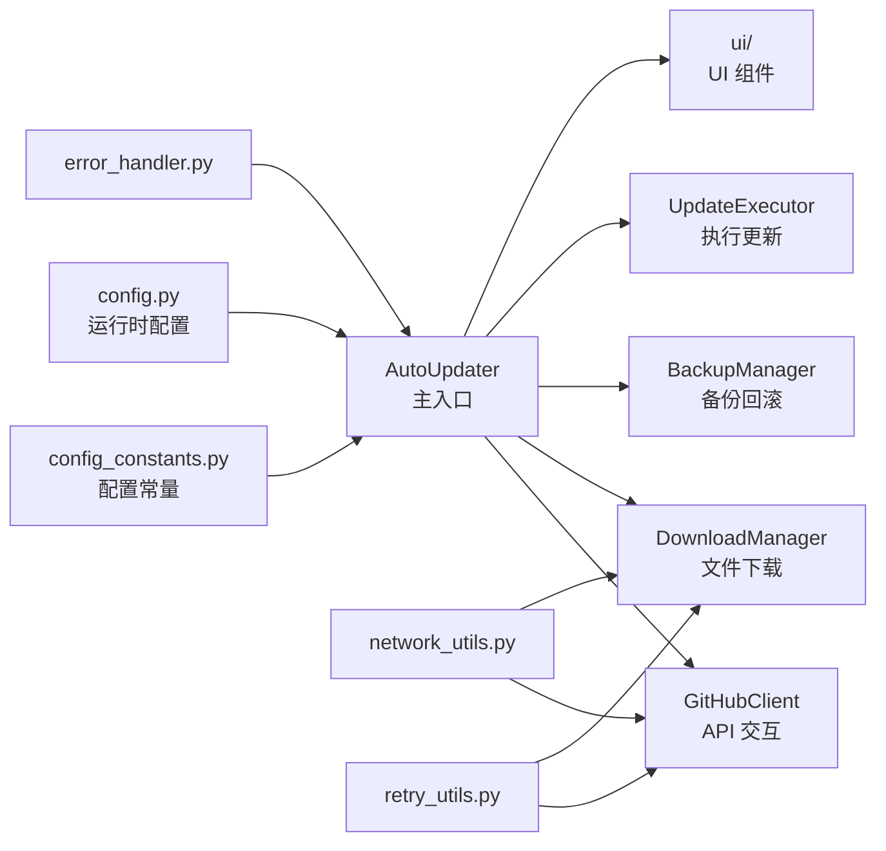

# auto_updater 模块

> [返回根目录](../CLAUDE.md) > auto_updater

## 模块概述

基于 GitHub Releases API 的自动更新模块，提供版本检查、文件下载、备份回滚和 UI 交互的完整更新流程。

## 架构



## 关键文件

| 文件 | 职责 |
|------|------|
| `__init__.py` | 模块入口，`AutoUpdater` 主类，异常类定义 |
| `config_constants.py` | 硬编码配置常量（版本号、GitHub 仓库、超时等） |
| `config.py` | 运行时配置管理，版本比较逻辑 |
| `github_client.py` | GitHub Releases API 客户端 |
| `download_manager.py` | 文件下载，支持进度回调 |
| `backup_manager.py` | 更新前备份与回滚 |
| `update_executor.py` | 执行文件替换更新 |
| `two_phase_updater.py` | 两阶段更新策略 |
| `network_utils.py` | 网络工具（连接池、代理检测） |
| `retry_utils.py` | 重试装饰器与策略 |
| `error_handler.py` | 统一错误处理 |
| `settings.py` | 持久化设置管理 |
| `auto_complete.py` | 自动完成辅助 |
| `integration_guide.py` | 集成指南代码 |

## UI 子模块 (`ui/`)

| 文件 | 职责 |
|------|------|
| `ui_manager.py` | UI 管理器基类 |
| `update_ui_manager.py` | 更新 UI 管理器 |
| `update_dialogs.py` | 更新对话框 |
| `dialogs.py` | 通用对话框（关于等） |
| `progress_dialog.py` | 下载进度对话框 |
| `async_download_thread.py` | 异步下载线程 |
| `widgets.py` | 自定义控件 |
| `resources.py` | UI 资源常量（文本、样式、配置） |

## 主要接口

```python
from auto_updater import AutoUpdater

updater = AutoUpdater(parent=main_window)
has_update, remote_ver, local_ver, err = updater.check_for_updates()
success, file_path, err = updater.download_update(version)
success, err = updater.execute_update(file_path, version)
success, err = updater.rollback_update()
```

## 依赖

- `packaging` — 版本号解析与比较
- `PyQt5` — UI 组件（可选，UI_AVAILABLE 标志）
- GitHub API — 版本发布信息获取

## 配置要点

- 当前版本: `config_constants.CURRENT_VERSION` (2.0.1)
- 仓库: `chen-huai/Sap_Hour_Operation`
- 检查间隔: 30 天
- 最大备份数: 3
