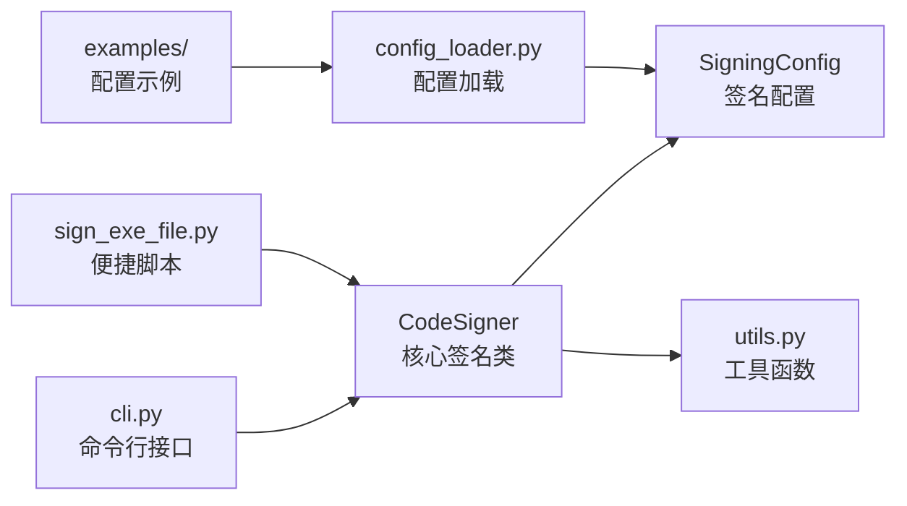

# code_signer 模块

> [返回根目录](../CLAUDE.md) > code_signer

## 模块概述

通用的 Windows EXE 数字签名工具模块，支持 signtool（Windows SDK）和 osslsigncode（开源替代）两种签名工具，提供签名、验证、记录管理的完整流程。

## 架构



## 关键文件

| 文件 | 职责 |
|------|------|
| `__init__.py` | 模块入口，便捷函数 `sign_file()` / `verify_file_signature()` |
| `core.py` | `CodeSigner` 核心类，`SigningRecord` 签名记录 |
| `config.py` | `SigningConfig` / `CertificateConfig` / `ToolConfig` 配置数据类 |
| `config_loader.py` | 从 JSON/Python 文件加载签名配置 |
| `utils.py` | 工具函数：查找签名工具、验证签名、文件哈希 |
| `cli.py` | 命令行接口入口 |
| `sign_exe_file.py` | 独立签名脚本 |
| `examples/` | 默认配置和项目配置示例 |

## 主要接口

```python
from code_signer import CodeSigner, sign_file, verify_file_signature

# 方式1: 使用类
signer = CodeSigner.from_config('config.py')
success, message = signer.sign_file('app.exe')

# 方式2: 便捷函数
success, message = sign_file('app.exe', 'certificate_name')
is_valid = verify_file_signature('app.exe')
```

## 依赖

- `subprocess` — 调用 signtool / osslsigncode
- `cryptography` — 证书处理
- `pefile` — PE 文件分析
- 签名证书: `170859-code-signing.cer`（根目录）

## 配置

- 签名配置: `signature_config.json`（根目录）
- 签名记录: `signature_records/` 目录
